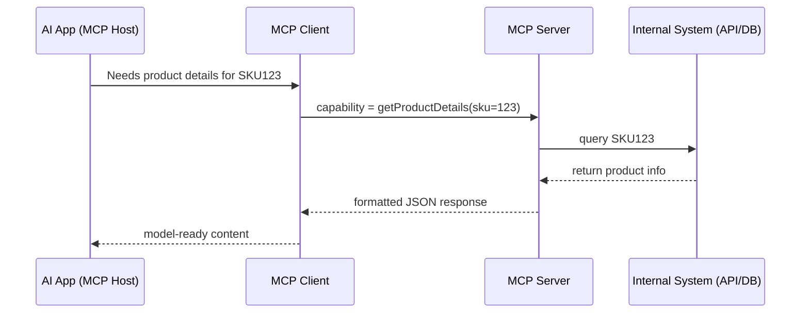

# Core Components of MCP Architecture

The Model Context Protocol (MCP) introduces a modular architecture made up of three primary components:

- 🧠 **MCP Host**
- 🔌 **MCP Client**
- 🛠️ **MCP Server**

Together, these components enable seamless communication between an AI model and your internal systems (APIs, databases, tools, etc.).

---

## 🧠 1. MCP Host

**What it is:**  
The AI application or assistant that initiates requests for external context or actions.

**Examples:**
- A chatbot using Claude or ChatGPT
- A developer assistant in an IDE
- A customer support agent built with an LLM backend

**Role:**
- Triggers requests when more information is needed
- Doesn't directly call APIs — instead, it calls the MCP Client

---

## 🔌 2. MCP Client

**What it is:**  
A middleware layer that sits between the Host and the Server.

**Role:**
- Intercepts the model’s calls
- Maps them to defined **capabilities**
- Sends structured requests to the appropriate MCP Server
- Parses and returns responses in a model-friendly format

**Bonus:**  
You can run the client locally or as a proxy/middleware in your infrastructure.

---

## 🛠️ 3. MCP Server

**What it is:**  
A service that exposes one or more **capabilities** (functions) the model can call.

**Examples:**
- `getUserInfo(userId)`
- `fetchInventory(sku)`
- `checkOrderStatus(orderId)`

**Role:**
- Receives structured requests from the MCP Client
- Validates, processes, and responds using internal logic
- Fetches data from APIs, databases, or file systems

**Tech Stack:**  
Can be written using MCP SDKs available in:
- Python
- TypeScript/Node.js
- Java
- C# (.NET)
- Kotlin

---

## 🔄 How They Work Together

## 🔐 Capabilities Explained

Capabilities are the atomic units of logic that the MCP Server exposes.

- Each capability is like an endpoint or a function (getTicketStatus, createInvoice, etc.)
- They define input/output schema
- They can be permission-controlled
- The model “calls” these instead of using raw APIs

---

## 🧩 Recap: Component Responsibilities

| Component     |                  Responsibility                           |
|---------------|-----------------------------------------------------------|
| MCP Host      | Triggers requests during an AI session                    |
| MCP Client    | Manages communication, formatting, routing                |
| MCP Server    | Executes logic and retrieves or performs data actions     |

> 📌 Think of MCP as an LLM-safe API architecture — giving you full control, structure, and security over what your model can access.
