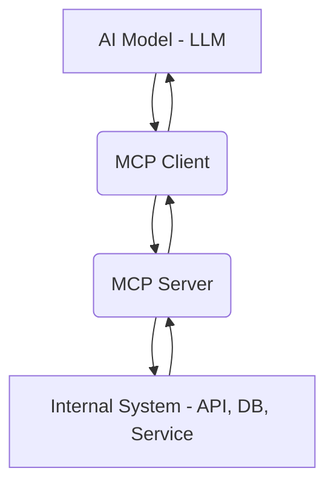

# MCP Data Flow

Understanding the data flow is essential to effectively implement and debug MCP integrations. Here's how data moves between the **AI model**, **MCP client**, **MCP server**, and your internal systems.

---

## 🔄 High-Level Flow

When an AI model needs external context (e.g., “What’s the status of Order #123?”), the request passes through the MCP pipeline in this order:



## 🔁 Step-by-Step Breakdown

1.AI Model (MCP Host)

- The LLM (e.g., Claude or ChatGPT) generates a structured request for more context.
- This request is often triggered by the system prompt or user input.
- It is passed to the MCP Client using a defined protocol (usually JSON).

2.MCP Client

- Acts as a translator between the model and your backend.
- Validates the request.
- Maps the requested capability (e.g., getUserInfo) to the right MCP Server.
- Sends the request with any parameters.

3.MCP Server

- Handles the logic for the requested capability.
- Queries the database, hits an API, or performs an action.
- Returns the result to the MCP Client in a clean, structured format.

4.Internal System (DB, API, etc.)

- The actual source of truth (e.g., SQL database, CRM, ERP).
- Responds to the query made by the MCP server.
- Never interacts with the model directly — fully abstracted via the MCP server.

5.Response Propagation

- The MCP Server sends the result back to the MCP Client.
- The MCP Client reformats the response (if necessary) for LLM consumption.
- The AI model receives the structured context and uses it to generate an intelligent reply.

## 📦 Data Format Example

Here’s what a capability request/response might look like under the hood:

### 📨 Request (from LLM to Client → Server)

```json
{
  "capability": "getOrderStatus",
  "arguments": {
    "orderId": "12345"
  }
}
```

### 📬 Response (from Server to Client → LLM)

```json
{
  "status": "success",
  "result": {
    "orderId": "12345",
    "status": "Shipped",
    "estimatedDelivery": "2025-04-02"
  }
}
```

---

## 🧠 Key Design Principles

- Separation of Concerns: LLMs focus on language; logic lives in MCP Servers.
- Security: Sensitive systems are only accessed through secure, capability-based endpoints.
- Scalability: Add new capabilities without changing your LLM prompts.
- Observability: Each stage (Client, Server, Backend) can be logged and monitored.

---

> ⚙️ The MCP data flow turns AI from a static responder into a dynamic problem-solver — safely plugged into your infrastructure.