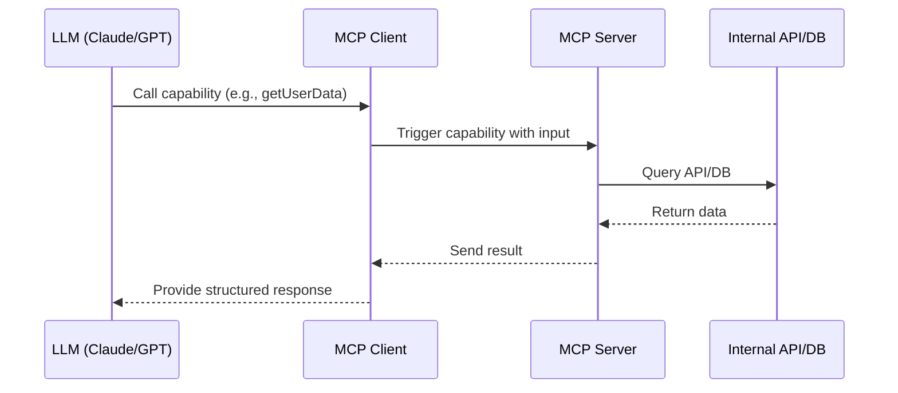
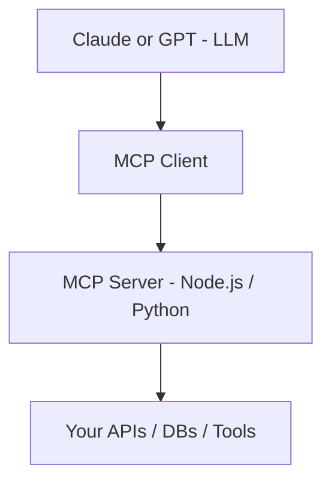

# Integrating MCP with LLMs

To bring your custom MCP Server to life, it needs to be connected to a **Large Language Model (LLM)** — such as Anthropic Claude or OpenAI GPT — via an **MCP Client**. This section covers how LLMs interact with MCP, and how you can integrate the entire flow.

---

## 🧠 How LLMs Use MCP

By design, LLMs cannot directly access APIs or databases. Instead, they rely on **structured protocols** like MCP to interact with the outside world.

Here’s the flow:



---

## 🔌 LLMs That Support MCP (or Custom Plugin Protocols)

| LLM Platform | Native MCP Support | Integration Method
| --- | --- | --- |
| Anthropic Claude | ✅ Yes | Claude + Tools via MCP
| OpenAI GPT | ❌ Not yet native | Use custom GPT function calling + MCP client proxy
| Google Gemini | ❌ Not yet native | Custom tool calling layer
| Meta LLaMA | ❌ Dev-only | Needs wrapper

## 🟢 Using Claude with MCP

Claude’s latest platform (via Anthropic Console or API) supports Tool Use through MCP clients.

**🪄 What You Need:**

- An MCP Client that connects Claude to your MCP Server
- A list of capabilities defined in your server
- Claude is able to invoke these capabilities in real time

📚 Learn more: [https://docs.anthropic.com/claude/docs/tools](https://docs.anthropic.com/claude/docs/tools)

---

## 🔄 Using GPT with MCP (Custom Integration)

Although GPT doesn’t natively support MCP, you can build a bridge using function calling and an MCP client on your backend.

**👇 Basic Flow**

1.Define function calls in the GPT API request
2.Use your MCP Client to resolve the call
3.Pass the result back into the model context

Example Code (Node.js)

```ts
const functions = [
  {
    name: "getOrderStatus",
    description: "Returns the status of a given order ID",
    parameters: {
      type: "object",
      properties: {
        orderId: { type: "string" }
      },
      required: ["orderId"]
    }
  }
]

const response = await openai.chat.completions.create({
  model: "gpt-4",
  messages: [...],
  functions,
  function_call: "auto"
})

// Intercept function call → trigger MCP client → return result
```

---

## ⚙️ Setting Up the MCP Client

You can either:

- Use the official Anthropic MCP Client SDK
- Build a lightweight HTTP client that calls your MCP Server
- Deploy the MCP Client as a middleware in your backend or bot framework

---

## 🔐 Capability Governance

When exposing MCP capabilities to an LLM, always:

- ✅ Restrict what can be called and by whom
- ✅ Validate arguments rigorously
- ✅ Avoid exposing raw system responses
- ✅ Rate limit or throttle sensitive capabilities

---

## 🧠 Use Case Examples

| LLM Prompt (User Says) | Capability Triggered |

| --- | --- |
| "What's the status of order #123?" | getOrderStatus(orderId) |
| "Book a meeting with Sarah tomorrow."| createCalendarEvent(...) |
| "Show me John’s recent tickets." | getSupportTickets(userId) |

---

## 📦 Sample Stack



---

## 🚀 Pro Tip

Log every LLM-to-capability call (input, output, duration) to a central store like Elastic or BigQuery — this gives you powerful insights into:

- What the model is asking for
- How often each capability is triggered
- Where slowdowns or errors occur

---

## 📚 Further Reading

- [Anthropic Tool Use (Claude)](https://docs.anthropic.com/claude/docs/tools)
- [OpenAI Function Calling](https://platform.openai.com/docs/guides/gpt/function-calling)
- [ModelContextProtocol.io](https://modelcontextprotocol.io)

---

> 💡 MCP turns LLMs from language models into real-time, data-driven agents — but only when you connect them to your systems the right way.
