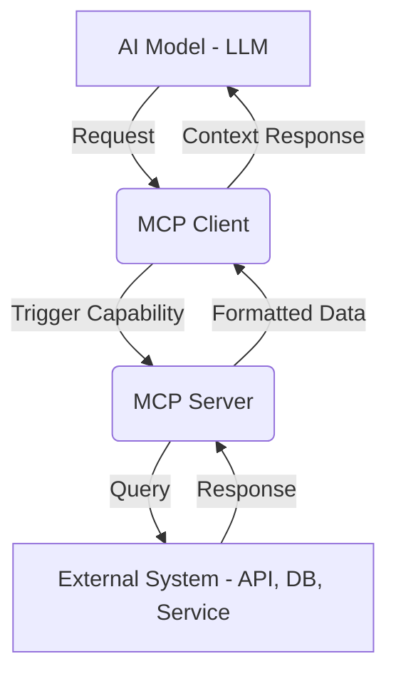
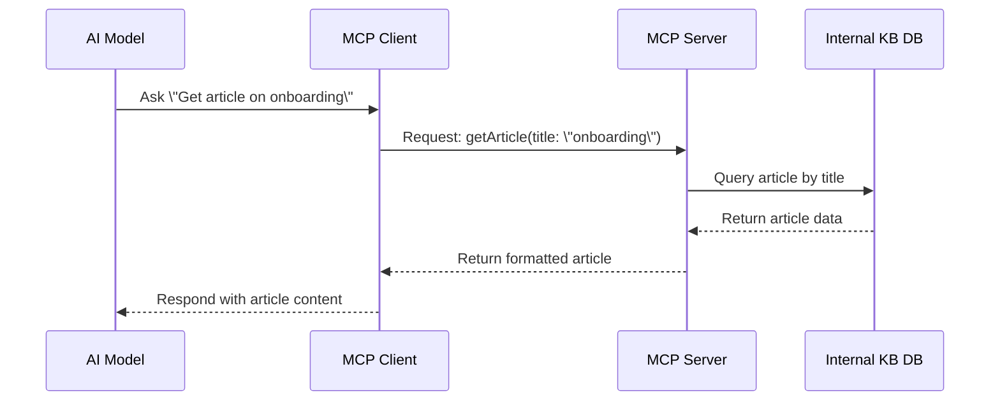

# What is MCP?

**Model Context Protocol (MCP)** is an open standard that allows AI models—like Claude or ChatGPT—to interact with external tools, APIs, databases, and services during a conversation. It enables LLMs to retrieve real-time information, perform actions, and stay in sync with your business logic.

---

## 🧠 Why It Matters

AI models are powerful, but by default, they only know what's in their training data or what you provide in a prompt.

MCP enables:

- **Real-time access to data**
- **Reduced token usage** by offloading context fetching
- **Dynamic behavior** through defined capabilities
- **Modular integration** with external systems

---

## 🔁 How It Works

MCP introduces a clean architecture with three key components:

---

## 🧩 Component Breakdown

- **MCP Host:** The application embedding the AI model (e.g., a chatbot, IDE plugin).
- **MCP Client:** Middleware that receives model calls and routes them to the appropriate MCP Server.
- **MCP Server:** The backend service that handles incoming capability requests and provides responses using external data.

---

## ⚙️ Example Use Case: Knowledge Base Access

Let’s say you want your AI assistant to access internal documentation.

---

## 🚀 Real-World Applications

- Customer support assistants accessing live ticket statuses.
- AI-powered dashboards querying sales reports.
- Agents triggering automation tools (like sending Slack messages or creating Jira tickets).

---

## 📚 Resources

- 🌐 [ModelContextProtocol.io](https://modelcontextprotocol.io/)
- 📰 [Anthropic’s Blog Post on MCP](https://www.anthropic.com/news/model-context-protocol)
- 💻 [GitHub: MCP SDKs](https://github.com/modelcontextprotocol)

---

> 🧠 Think of MCP as the API bridge between your data/tools and the AI brain. It turns LLMs from “know-it-all oracles” into “hands-on assistants.”
