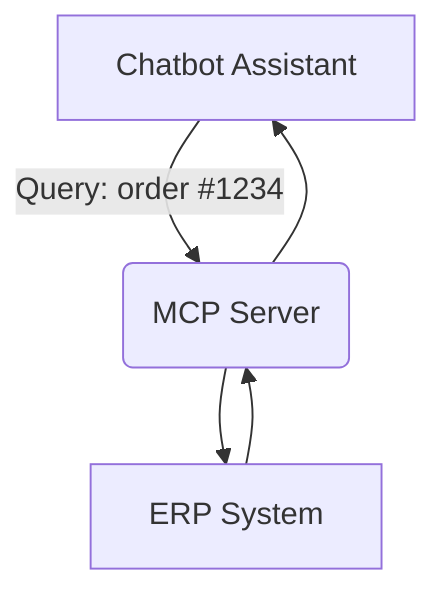

# Why MCP Server?

The **MCP Server** is the backbone of Model Context Protocol architecture — it gives AI models real-time access to your tools, APIs, data, and business logic. Without it, your AI app is just guessing based on its training.

---

## 🚧 The Problem with Static Prompts

LLMs like GPT or Claude are powerful, but:

- They can’t access your live data.
- Prompts get bloated trying to include too much context.
- They can’t perform actions in your system (e.g., query DB, send email, fetch logs).
- Keeping them updated with the latest internal changes is hard.

---

## ✅ The MCP Server Solution

MCP servers expose **capabilities** — like `getUserById`, `fetchInvoice`, or `checkInventory` — that the AI model can call during a conversation. These are defined once and reused across hosts.

By using an MCP server, you enable your AI to:

- Access live business data during chat or decision-making.
- Automate tasks or workflows securely and modularly.
- Delegate technical logic (data transformation, validation, querying) outside the model.

---

## 🔁 Why Not Just Use APIs?

MCP servers are better than direct API calls for a few reasons:

| Feature                      | Direct API Access | MCP Server |
|-----------------------------|-------------------|------------|
| AI-Aware Communication      | ❌                | ✅         |
| Secure Capability Control   | ❌                | ✅         |
| Structured Result Handling  | ❌                | ✅         |
| Reusability Across Agents   | ❌                | ✅         |
| Model-Friendly Responses    | ❌                | ✅         |

---

## 📈 Example Benefits

- **Scalability**: Add new capabilities without retraining models or rewriting prompts.
- **Security**: Expose only what the model needs via capabilities — no open APIs.
- **Maintainability**: Business logic lives in the MCP server, not spread across prompts or app logic.
- **Flexibility**: Swap out backends (e.g., DB → API → mock service) without changing the AI integration.

---

## 🧠 Real-World Scenario

A customer asks your AI assistant about their order. The assistant:

- Sends the order ID to the MCP server.
- The server queries the ERP.
- Returns a well-formatted response to the LLM.

The AI looks intelligent, up-to-date, and helpful — because it is.

---

## 🔒 Designed for Control

With an MCP server, you get:

- Full control over what the AI can and can’t access.
- Structured responses to avoid hallucination.
- Auditability for every call made during a session.

> 💡 Use MCP servers when you want your AI to think and act — based on real, live data from your systems.
